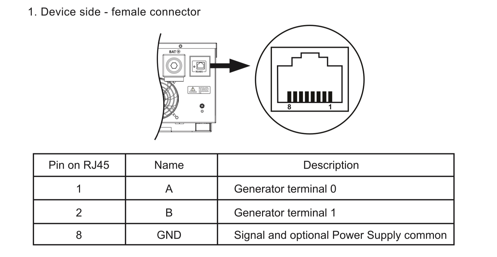
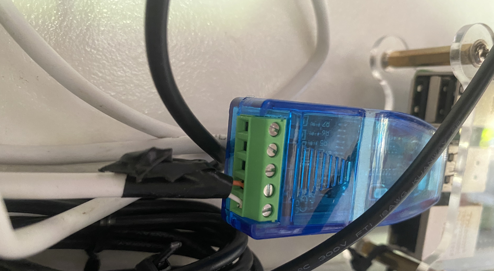
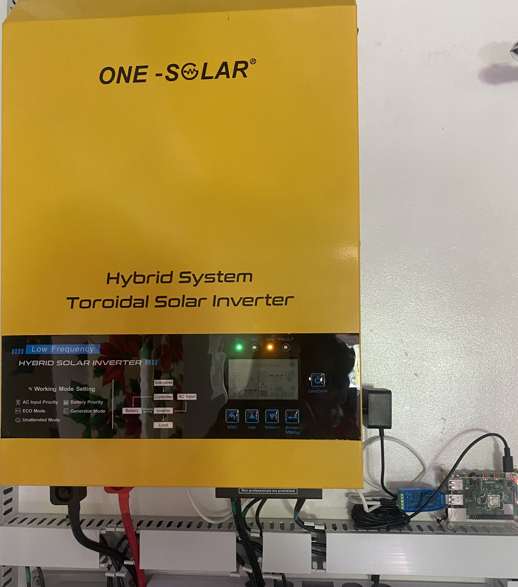

# Communication Script for "One Inverter" Hybrid Solar Inverter

**CURRENTLY STILL A WORK IN PROGRESS**

A couple of months ago, I installed my first PV System. With a budget in mind, I opted for the 48V 6kW Hybrid Inverter from "One Inverter," also known as "One Solar." Surprisingly, it featured an RJ45 port, enabling serial communication with the device. It utilizes the RS-485 standard for point-to-point communication and implements the Modbus protocol.

After contacting the company, they provided me with the API for their Modbus specifications.

The `run.py` script in this repository allows connection to the inverter and reads all relevant input registers. It operates continuously, saving the data every 3 seconds to a CSV file. A new CSV file is created daily.

Additionally, `dashboard/app.py` offers a simple Streamlit dashboard for displaying these values.

Set up on a Raspberry Pi, this configuration enables easy access to the inverter's metrics from any browser on a mobile or desktop device, anytime and anywhere.

To connect from the RJ45 to the Raspberry Pi, I used an old ethernet cabe, cut off one end and attached the 2 wires at Pin 1 and 2 to a serial-to-usb-adapter. I used this **URL to USB-Adapter** Adpater which can be ordered at only xxxPHP plus shipping.

**Pic of dashboard**

## Todo:

* Setup raspberry and run everything
* make photos: cable, adapter, raspi, inverter, dashboard
* Create daily metrics in dashboard
* Write about the Adapter and cable
* Write on how to setup raspberry